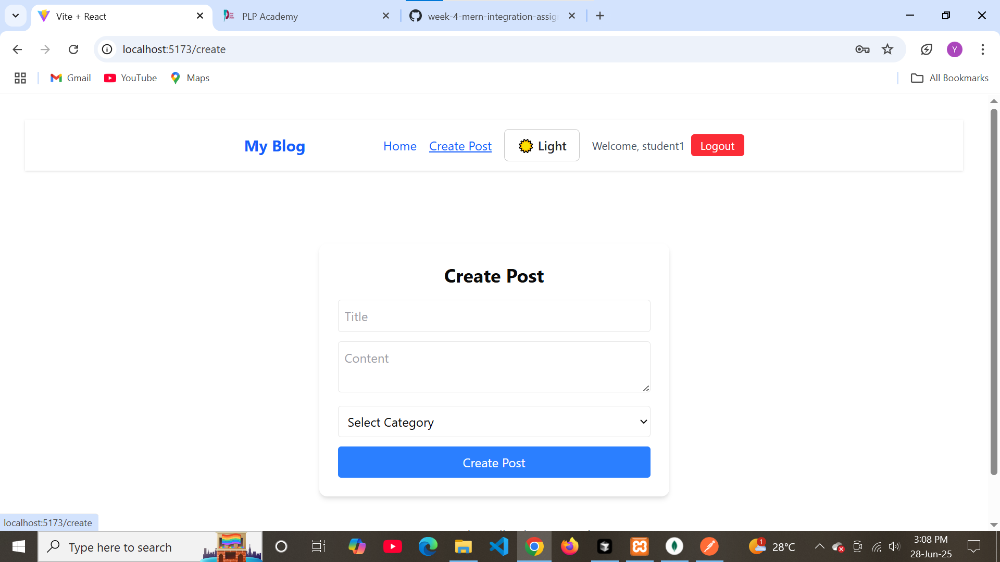

# MERN Blog Application

## Project Overview

This is a full-stack blog application built with the MERN stack (MongoDB, Express.js, React.js, Node.js). It allows users to register, log in, create, edit, and delete blog posts, as well as categorize, search, and filter posts. The app features user authentication, protected routes, pagination, search, filter, and a responsive UI with dark mode.

---

## Setup Instructions

### 1. Clone the Repository

```sh
git clone <your-repo-url>
cd <your-repo-folder>
```

### 2. Install Dependencies

#### Server

```sh
cd server
npm install
```

#### Client

```sh
cd ../client
npm install
```

### 3. Environment Variables

- Copy `.env.example` to `.env` in both `server/` and `client/` folders.
- Update the values as needed (e.g., MongoDB URI, JWT secret).

### 4. Start the Application

#### Start the Backend

```sh
cd server
npm run dev
```

#### Start the Frontend

```sh
cd ../client
npm run dev
```

- The backend will run on `http://localhost:5000`
- The frontend will run on `http://localhost:5173` (or as specified by Vite)

---

## API Documentation

### Auth

- `POST /api/auth/register` — Register a new user
- `POST /api/auth/login` — Login and receive a JWT token

### Posts

- `GET /api/posts` — Get all posts (supports pagination, search, filter)
- `GET /api/posts/:id` — Get a single post by ID
- `POST /api/posts` — Create a new post (auth required)
- `PUT /api/posts/:id` — Update a post (auth required)
- `DELETE /api/posts/:id` — Delete a post (auth required)

### Categories

- `GET /api/categories` — Get all categories
- `POST /api/categories` — Create a new category

---

## Features Implemented

- User registration and login (JWT authentication)
- Create, read, update, and delete blog posts
- Create and list categories
- Pagination, search, and filter for posts
- Responsive UI with dark mode toggle
- Protected routes for authenticated users
- Error handling and user feedback
- Clean code organization (controllers, models, routes, middleware, hooks, services, context)

---

## Screenshots

### Home Page


### Create Post



### Dark Mode


### login


### register page


---
